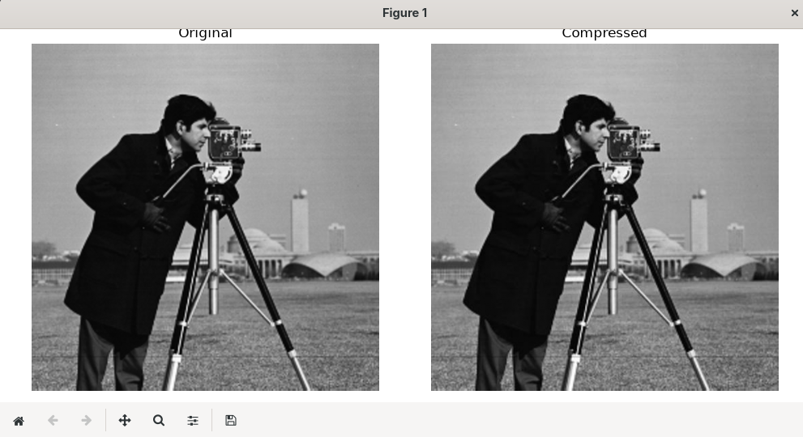
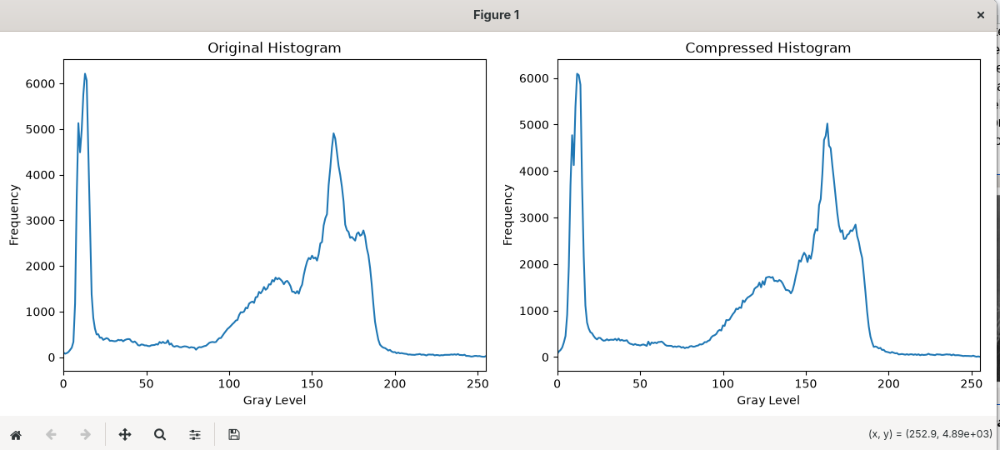
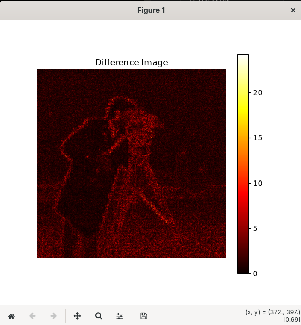
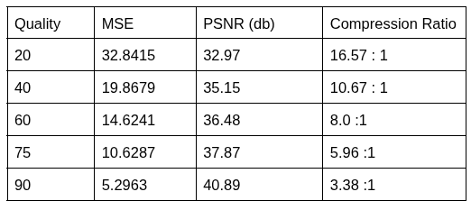

<h1 align="center">
JPEG Image Compression using Manual Discrete Cosine Transform (DCT)
</h1>

<p align="center">
A Multimedia Engineering project implementing the Baseline JPEG compression algorithm using the mathematical formulation of the two-dimensional Discrete Cosine Transform (2D-DCT) from scratch in Python.
</p>

<p align="center">


</p>

---

# 📖 Overview

This project implements the core stages of the Baseline JPEG image compression algorithm using the mathematical equations of the two-dimensional Discrete Cosine Transform (2D-DCT).

Unlike conventional implementations that rely on built-in DCT libraries such as OpenCV or SciPy, this project computes both the Forward DCT and the Inverse DCT directly from the mathematical equations presented in the Multimedia Engineering course. Supporting libraries are only used for image loading, matrix manipulation, and visualization.

The implementation demonstrates how image information is transformed from the spatial domain into the frequency domain, compressed through quantization, and reconstructed using the Inverse DCT.

---

# ✨ Features

- Manual implementation of 2D Discrete Cosine Transform (DCT)
- Manual implementation of Inverse DCT (IDCT)
- JPEG Quantization
- Inverse Quantization
- Image Reconstruction
- Histogram Comparison
- Difference Image Visualization
- Mean Squared Error (MSE)
- Peak Signal-to-Noise Ratio (PSNR)
- Estimated Compression Ratio
- Interactive Command Line Interface (CLI)

---

# 📂 Project Structure

```text
JPEG-DCT-Compression
│
├── datasets/
│   ├── lena_gray_512.tif
│   ├── cameraman.tif
│   └── barbara.bmp
│
├── output/
│
├── dct.py
├── quantization.py
├── metrics.py
├── graphs.py
├── utils.py
├── jpeg_dct.py
│
├── requirements.txt
├── README.md
└── .gitignore
```

---

# ⚙ JPEG Compression Workflow

```text
Input Image
      │
      ▼
Read Grayscale Image
      │
      ▼
Split into 8 × 8 Blocks
      │
      ▼
Level Shift (-128)
      │
      ▼
Manual 2D-DCT
      │
      ▼
JPEG Quantization
      │
      ▼
Inverse Quantization
      │
      ▼
Manual IDCT
      │
      ▼
Reverse Level Shift (+128)
      │
      ▼
Merge Blocks
      │
      ▼
Compressed Image
      │
      ▼
Performance Evaluation
(MSE, PSNR, Compression Ratio)
```

---

# 📊 Performance Evaluation

The implementation evaluates compression performance using the Lena benchmark image with different JPEG quality factors.

| Quality Factor | MSE | PSNR (dB) | Compression Ratio |
|---------------:|----:|----------:|------------------:|
|20|32.8415|32.97|16.57 : 1|
|40|19.8679|35.15|10.67 : 1|
|60|14.6241|36.48|8.00 : 1|
|75|10.6287|37.87|5.96 : 1|
|90|5.2963|40.89|3.38 : 1|

> **Observation**
>
> Lower quality factors produce higher compression ratios but lower reconstructed image quality. Higher quality factors preserve more image details, resulting in lower MSE and higher PSNR.

---

# 🖼 Sample Results

## Original vs Compressed Image



---

## Histogram Comparison



---

## Difference Image



---

## Compression Performance



---

# 💻 Installation

Clone the repository

```bash
git clone https://github.com/YOUR_USERNAME/JPEG-DCT-Compression.git
```

Move into the project directory

```bash
cd JPEG-DCT-Compression
```

Install the required libraries

```bash
pip install -r requirements.txt
```

Run the program

```bash
python jpeg_dct.py
```

---

# 📚 Technologies Used

- Python 3
- NumPy
- Pillow
- Matplotlib

---

# 📖 References

1. Heri Prasetyo, *Image JPEG Compression Using Discrete Cosine Transform*, Multimedia Engineering Course Notes, Universitas Sebelas Maret, 2026.

2. R. C. Gonzalez and R. E. Woods, *Digital Image Processing*, 4th Edition, Pearson, 2018.

3. W. B. Pennebaker and J. L. Mitchell, *JPEG Still Image Data Compression Standard*, Springer, 1993.

---

# 👨‍💻 Author

**Zayyanu Awwal**

L0123147

Informatics Study Program

Faculty of Information Technology and Data Science

Universitas Sebelas Maret

2026

---

<p align="center">
⭐ If you found this project helpful, consider giving it a star.
</p>